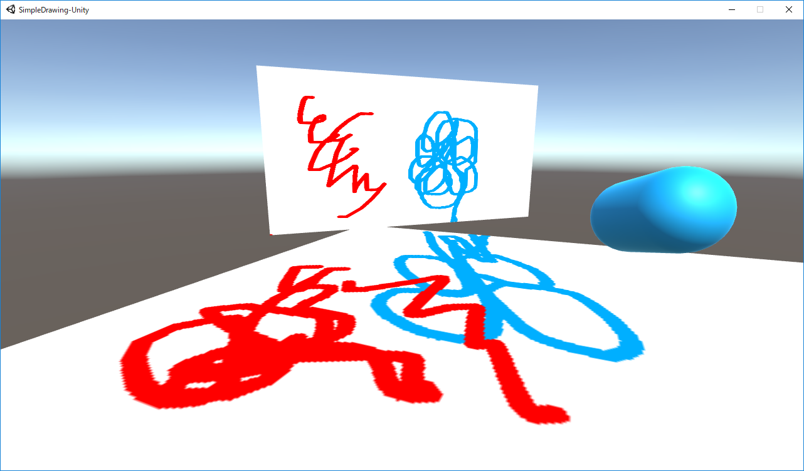

# Simple Drawing for Unity

[Unityでテクスチャにお絵描きするための線分描画アルゴリズムの話 ](https://speakerdeck.com/sotanmochi/line-drawing-algorithm-using-fragment-shader)

## Tested Environment
- Unity 2018.4.28f1
- Windows 10 Pro

## License
- MIT License
